# Hi, I'm Ali Nabilah Ramadhan

L2 Operational Analyst / Application Technical Support & Frontend Developer based in Indonesia.

## About Me

[](https://visitor-badge.laobi.icu/badge?page_id=morganaaa1.morganaaa1)
[](mailto:alinabilahramadhan@gmail.com)
[](https://linkedin.com/in/alinabilahramadhan)
[](https://github-readme-stats.vercel.app/api?username=morganaaa1&hide_title=false&hide_border=true&show_icons=true&include_all_commits=true&line_height=20&bg_color=0,EC6C6C,FFD479,FFFC79,73FA79&theme=graywhite&locale=en)
[](https://github.com/morganaaa1?tab=followers)

## Experience

### 🔴 **L2 Operational Analyst – Turbo Charging / R1**
*Telkomsel* | **May 2023 — Present**
- Managed Application Transaction called **Turbo Charging / Revenue One** at Telkomsel.
- Responsible for monitoring incident alerts, identifying, analyzing, and solving cases according to defined SLAs.
- Provided advisory and hands-on troubleshooting based on service to solve customer issues according to the SLA.

### 🔷 **Frontend Developer – Paradina**
*Paradina* | **Oct 2023 — Dec 2023**
- Built and developed web app ordering management system for Paradina.

### 💳 **L2 Application Technical Support – Payment Gateway**
*Telkomsel* | **Feb 2023 — May 2023**
- Managed Application API Transaction Payment Gateway at Telkomsel.
- Monitored incident alerts, identified, analyzed, and solved cases according to defined SLAs.
- Conducted implementation and ensured deployment and configuration based on work order and timeline.
- Provided advisory and hands-on troubleshooting based on service to solve customer issues according to SLA.

### 📱 **L2 Application Technical Support – DigiPOS Aja!**
*Telkomsel* | **Jan 2022 — Jan 2023**
- Managed Application Transaction called **DigiPOS** at Telkomsel.
- Monitored incident alerts, identified, analyzed, and solved cases according to defined SLAs.
- Conducted implementation and ensured deployment and configuration based on work order and timeline.
- Provided advisory and hands-on troubleshooting based on service to solve customer issues according to SLA.

## Education

- **Software Engineering** – SMKN 1 KATAPANG

## Tools

<a href="https://github.com" target="_blank">  </a> <a href="https://code.visualstudio.com/" target="_blank">  </a> <a href="https://figma.com" target="_blank">  </a> <a href="https://www.redhat.com/" target="_blank">  </a> <a href="https://postman.com" target="_blank" rel="noreferrer">  </a>

## Technology Stack

<a href="https://developer.mozilla.org/en-US/docs/Web/JavaScript" target="_blank" rel="noreferrer">  </a> <a href="https://reactjs.org/" target="_blank" rel="noreferrer">  </a> <a href="https://www.elastic.co" target="_blank" rel="noreferrer">  </a> <a href="https://www.openshift.com/" target="_blank" rel="noreferrer">  </a> <a href="https://www.dynatrace.com/" target="_blank" rel="noreferrer">  </a> <a href="https://grafana.com" target="_blank" rel="noreferrer">  </a> <a href="https://www.splunk.com/" target="_blank" rel="noreferrer">  </a> <a href="https://www.mysql.com/" target="_blank" rel="noreferrer">  </a> <a href="https://www.linux.org/" target="_blank" rel="noreferrer">  </a>

## Stats



<p></p>




<!--START_SECTION:waka-->


**🐱 My GitHub Data** 

> 📦 ? Used in GitHub's Storage 
 > 
> 🏆 60 Contributions in the Year 2026
 > 
> 🚫 Not Opted to Hire
 > 
> 📜 30 Public Repositories 
 > 
> 🔑 0 Private Repositories 
 > 
**I'm an Early 🐤** 

```text
🌞 Morning                132 commits         █████████░░░░░░░░░░░░░░░░   36.16 % 
🌆 Daytime                206 commits         ██████████████░░░░░░░░░░░   56.44 % 
🌃 Evening                19 commits          █░░░░░░░░░░░░░░░░░░░░░░░░   05.21 % 
🌙 Night                  8 commits           █░░░░░░░░░░░░░░░░░░░░░░░░   02.19 % 
```
📅 **I'm Most Productive on Thursday** 

```text
Monday                   69 commits          █████░░░░░░░░░░░░░░░░░░░░   18.90 % 
Tuesday                  35 commits          ██░░░░░░░░░░░░░░░░░░░░░░░   09.59 % 
Wednesday                81 commits          ██████░░░░░░░░░░░░░░░░░░░   22.19 % 
Thursday                 106 commits         ███████░░░░░░░░░░░░░░░░░░   29.04 % 
Friday                   44 commits          ███░░░░░░░░░░░░░░░░░░░░░░   12.05 % 
Saturday                 18 commits          █░░░░░░░░░░░░░░░░░░░░░░░░   04.93 % 
Sunday                   12 commits          █░░░░░░░░░░░░░░░░░░░░░░░░   03.29 % 
```


📊 **This Week I Spent My Time On** 

```text
🕑︎ Time Zone: Asia/Jakarta

💬 Programming Languages: 
No Activity Tracked This Week

🔥 Editors: 
No Activity Tracked This Week

🐱‍💻 Projects: 
No Activity Tracked This Week

💻 Operating System: 
No Activity Tracked This Week
```

🤖 **AI Coding This Week** 

```text
No AI Coding Activity Tracked This Week
```

**I Mostly Code in JavaScript** 

```text
JavaScript               19 repos            ████████████░░░░░░░░░░░░░   47.50 % 
TypeScript               6 repos             ████░░░░░░░░░░░░░░░░░░░░░   15.00 % 
Python                   4 repos             ██░░░░░░░░░░░░░░░░░░░░░░░   10.00 % 
HTML                     2 repos             █░░░░░░░░░░░░░░░░░░░░░░░░   05.00 % 
Jinja                    1 repo              █░░░░░░░░░░░░░░░░░░░░░░░░   02.50 % 
```


**Timeline**


 Last Updated on 06/09/2026 04:07:26 UTC
<!--END_SECTION:waka-->

<!--
**morganaaa1/morganaaa1** is a ✨ _special_ ✨ repository because its `README.md` (this file) appears on your GitHub profile.

Here are some ideas to get you started:

- 🔭 I’m currently working on ...
- 🌱 I’m currently learning ...
- 👯 I’m looking to collaborate on ...
- 🤔 I’m looking for help with ...
- 💬 Ask me about ...
- 📫 How to reach me: ...
- 😄 Pronouns: ...
- ⚡ Fun fact: ...
-->
